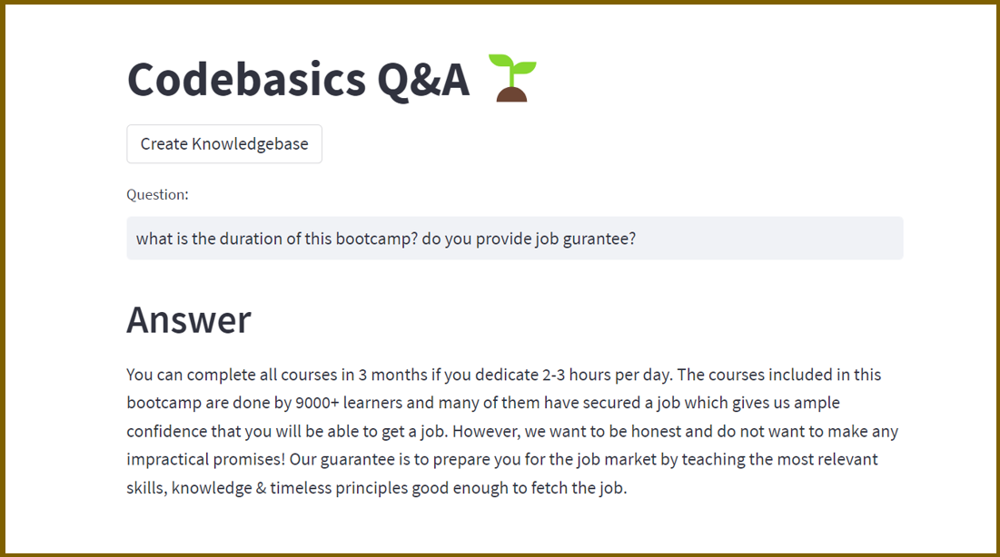

# 🎓 Codebasics Q&A Assistant

[](https://www.python.org/)
[](https://streamlit.io/)
[](https://python.langchain.com/)
[](https://ai.google.dev/)
[](https://opensource.org/licenses/MIT)

> **An AI-powered Question & Answer system built with Google Gemini LLM and LangChain to automate customer support for e-learning platforms**

## 📖 Table of Contents

- [Overview](#-overview)
- [Features](#-features)
- [Demo](#-demo)
- [Tech Stack](#-tech-stack)
- [Prerequisites](#-prerequisites)
- [Installation](#-installation)
- [Configuration](#-configuration)
- [Usage](#-usage)
- [Project Structure](#-project-structure)
- [API Reference](#-api-reference)
- [Contributing](#-contributing)
- [Troubleshooting](#-troubleshooting)
- [License](#-license)
- [Support](#-support)
- [Acknowledgments](#-acknowledgments)

## 🔍 Overview

The **Codebasics Q&A Assistant** is an intelligent customer support system designed specifically for e-learning platforms. Built for [Codebasics](https://codebasics.io), this system leverages cutting-edge AI technology to provide instant, accurate answers to student queries, significantly reducing the workload on human support staff.

### 🎯 Problem Statement

- **Challenge**: Codebasics receives thousands of student queries via Discord and email daily
- **Impact**: Human staff spend countless hours answering repetitive questions
- **Solution**: AI-powered Q&A system that provides instant, contextually relevant answers

### 💡 Value Proposition

- **⚡ Instant Responses**: Get answers in seconds, not hours
- **🎯 High Accuracy**: Trained on real FAQ data used by Codebasics support team
- **📈 Scalability**: Handle unlimited concurrent queries
- **💰 Cost Effective**: Reduce human support workload by up to 80%

## ✨ Features

### Core Functionality
- 🤖 **AI-Powered Responses** - Leverages Google Gemini Pro LLM for intelligent answers
- 📚 **Knowledge Base** - Built from 250+ real Codebasics FAQs
- 🔍 **Semantic Search** - Advanced vector similarity search using FAISS
- 💬 **Interactive UI** - Clean, modern Streamlit interface
- ⚡ **Real-time Processing** - Instant query processing and response generation

### Advanced Features
- 🎯 **Context-Aware** - Understands query context for more accurate responses
- 📊 **Source Attribution** - Shows which FAQ documents were used for answers
- 🔄 **Dynamic Knowledge Base** - Easy to update with new FAQ data
- 📱 **Responsive Design** - Works seamlessly across devices
- 🛡️ **Error Handling** - Graceful handling of edge cases and API failures

### Educational Benefits
- 📖 **Learn Modern AI Stack** - Hands-on experience with LangChain, vector databases, and LLMs
- 🏗️ **Production-Ready Code** - Industry-standard patterns and best practices
- 🔧 **Extensible Architecture** - Easy to modify and extend for other use cases

## 🎬 Demo



*The intuitive interface allows students to ask questions naturally and receive instant, contextually relevant answers.*

## 🛠️ Tech Stack

### Backend & AI
- **[Python 3.8+](https://python.org/)** - Core programming language
- **[LangChain](https://python.langchain.com/)** - LLM application framework
- **[Google Gemini Pro](https://ai.google.dev/)** - Large Language Model
- **[FAISS](https://faiss.ai/)** - Vector similarity search
- **[HuggingFace Transformers](https://huggingface.co/transformers/)** - Text embeddings

### Frontend & UI  
- **[Streamlit](https://streamlit.io/)** - Web application framework
- **[HTML/CSS](https://developer.mozilla.org/en-US/docs/Web/HTML)** - Custom styling

### Data & Configuration
- **[CSV](https://docs.python.org/3/library/csv.html)** - FAQ data storage
- **[Python-dotenv](https://pypi.org/project/python-dotenv/)** - Environment configuration
- **[Protobuf](https://developers.google.com/protocol-buffers)** - Data serialization

## 📋 Prerequisites

Before you begin, ensure you have the following installed:

- **Python 3.8 or higher** ([Download Python](https://python.org/downloads/))
- **Git** ([Download Git](https://git-scm.com/downloads))
- **Google API Key** ([Get API Key](https://makersuite.google.com/))

### System Requirements
- **RAM**: Minimum 4GB (8GB recommended)
- **Storage**: At least 2GB free space
- **Internet**: Stable connection for API calls
- **OS**: Windows 10+, macOS 10.14+, or Linux

## 🚀 Installation

### 1. Clone the Repository

```bash
git clone https://github.com/saksham-1304/Dummy-Repo.git
cd Dummy-Repo
```

### 2. Create Virtual Environment (Recommended)

```bash
# Create virtual environment
python -m venv venv

# Activate virtual environment
# On Windows:
venv\Scripts\activate
# On macOS/Linux:
source venv/bin/activate
```

### 3. Install Dependencies

```bash
pip install -r requirements.txt
```

### 4. Verify Installation

```bash
python -c "import streamlit, langchain; print('Installation successful!')"
```

## ⚙️ Configuration

### 1. Environment Setup

Create a `.env` file in the project root:

```bash
# Create .env file
touch .env
```

### 2. Add API Key

Add your Google API key to the `.env` file:

```env
GOOGLE_API_KEY=your_actual_api_key_here
```

### 3. Get Google API Key

1. Visit [Google AI Studio](https://makersuite.google.com/)
2. Sign in with your Google account
3. Create a new API key
4. Copy the key to your `.env` file

> ⚠️ **Security Note**: Never commit your API key to version control. The `.env` file is already in `.gitignore`.

## 🏃‍♂️ Usage

### Quick Start

```bash
# Start the application
streamlit run main.py
```

The application will open in your default browser at `http://localhost:8501`

### Step-by-Step Usage

1. **Initialize Knowledge Base**
   - Click the "Create Knowledge Base" button in the sidebar
   - Wait for the process to complete (may take 30-60 seconds)
   - You'll see a `faiss_index` directory created

2. **Ask Questions**
   - Type your question in the question box
   - Press Enter or click Submit
   - View the AI-generated response instantly

3. **Explore Features**
   - Check the chat history in the sidebar
   - View source documents used for answers
   - Try different types of questions

### Sample Questions to Try

```
💡 Course Related:
- "Do you have JavaScript courses?"
- "What's the duration of the data science bootcamp?"

💰 Pricing & Payment:
- "Do you offer EMI payment options?"
- "What's your refund policy?"

🖥️ Technical Support:
- "Can I use Power BI on Mac?"
- "How do I enable Power Pivot?"

🎯 Career & Learning:
- "Do you provide job assistance?"
- "Is this suitable for complete beginners?"
```

## 📁 Project Structure

```
Dummy-Repo/
├── 📄 README.md                    # Project documentation
├── 🐍 main.py                      # Streamlit web application
├── 🔧 langchain_helper.py          # LangChain & AI logic
├── 📊 codebasics_faqs.csv          # FAQ dataset (250+ entries)
├── 📋 requirements.txt             # Python dependencies
├── 🖼️  codebasics_q_and_a.png      # Demo screenshot
├── 📓 google_palm_codebasics_q_and_a.ipynb  # Jupyter notebook
├── 🔒 .env                         # Environment variables
├── 📚 faiss_index/                 # Vector database (generated)
└── 🙈 .gitignore                   # Git ignore rules
```

### Key Files Description

| File | Purpose | Description |
|------|---------|-------------|
| `main.py` | Frontend | Streamlit UI, user interactions, styling |
| `langchain_helper.py` | Backend | LLM integration, vector DB operations |
| `codebasics_faqs.csv` | Data | Source FAQ data for training |
| `requirements.txt` | Config | Python package dependencies |
| `.env` | Config | API keys and environment variables |

## 🔌 API Reference

### Core Functions

#### `create_vector_db()`
Creates and saves the FAISS vector database from FAQ CSV file.

```python
def create_vector_db():
    """
    Load FAQ data, create embeddings, and save vector database.
    
    Returns:
        bool: True if successful, raises exception if failed
    """
```

#### `get_qa_chain()`
Creates the question-answering chain using LangChain.

```python
def get_qa_chain():
    """
    Load vector DB and create RetrievalQA chain.
    
    Returns:
        RetrievalQA: Configured QA chain ready for queries
    """
```

### Environment Variables

| Variable | Required | Description | Example |
|----------|----------|-------------|---------|
| `GOOGLE_API_KEY` | ✅ Yes | Google Gemini API key | `AIzaSy...` |

## 🤝 Contributing

We welcome contributions! Here's how you can help:

### Getting Started

1. **Fork the repository**
2. **Create a feature branch**
   ```bash
   git checkout -b feature/amazing-feature
   ```
3. **Make your changes**
4. **Test thoroughly**
5. **Commit with clear messages**
   ```bash
   git commit -m "Add: Amazing new feature"
   ```
6. **Push to your fork**
   ```bash
   git push origin feature/amazing-feature
   ```
7. **Create a Pull Request**

### Development Guidelines

#### Code Style
- Follow [PEP 8](https://pep8.org/) for Python code
- Use meaningful variable and function names
- Add docstrings for all functions
- Keep functions small and focused

#### Testing
- Test your changes locally before submitting
- Verify the UI works correctly
- Check that the knowledge base creation works
- Test with various question types

#### Documentation
- Update README if you add new features
- Add inline comments for complex logic
- Update requirements.txt if adding dependencies

### Types of Contributions

- 🐛 **Bug Fixes** - Fix issues and improve stability
- ✨ **New Features** - Add functionality and capabilities  
- 📚 **Documentation** - Improve guides and examples
- 🎨 **UI/UX** - Enhance the user interface
- ⚡ **Performance** - Optimize speed and efficiency
- 🧪 **Testing** - Add tests and quality assurance

## 🔧 Troubleshooting

### Common Issues

#### Installation Problems

**Issue**: `pip install` fails with dependency conflicts
```bash
# Solution: Use a fresh virtual environment
python -m venv fresh_env
source fresh_env/bin/activate  # or fresh_env\Scripts\activate on Windows
pip install -r requirements.txt
```

**Issue**: `faiss-cpu` version not found
```bash
# Solution: Install compatible version
pip install faiss-cpu==1.8.0
```

#### Runtime Errors

**Issue**: "API key not found" error
- ✅ Check `.env` file exists in project root
- ✅ Verify `GOOGLE_API_KEY` is spelled correctly
- ✅ Ensure no spaces around the `=` sign
- ✅ Restart the application after adding the key

**Issue**: Knowledge base creation fails
- ✅ Check `codebasics_faqs.csv` file exists
- ✅ Verify internet connection for downloading embeddings
- ✅ Ensure sufficient disk space (500MB+)

**Issue**: Streamlit app won't start
```bash
# Check if port 8501 is already in use
streamlit run main.py --server.port 8502
```

#### Performance Issues

**Issue**: Slow response times
- ✅ Check internet connection speed
- ✅ Verify Google API quota hasn't been exceeded
- ✅ Consider using a local embedding model for development

**Issue**: High memory usage
- ✅ Close other applications
- ✅ Use smaller embedding models if needed
- ✅ Clear browser cache

### Getting Help

1. **Check existing issues**: [GitHub Issues](https://github.com/saksham-1304/Dummy-Repo/issues)
2. **Create new issue**: Use our issue templates
3. **Join discussions**: [GitHub Discussions](https://github.com/saksham-1304/Dummy-Repo/discussions)

## 📄 License

This project is licensed under the **MIT License** - see the [LICENSE](LICENSE) file for details.

### What this means:
- ✅ **Commercial use** - Use for commercial projects
- ✅ **Modification** - Modify and distribute changes  
- ✅ **Distribution** - Share and redistribute
- ✅ **Private use** - Use privately without restrictions
- ❌ **Liability** - No warranty or liability provided
- ❌ **Trademark** - No trademark rights granted

## 📞 Support

### Get Help

- 📧 **Email**: [Contact Form](mailto:support@example.com)
- 💬 **Discord**: [Join our community](https://discord.gg/codebasics)
- 📋 **Issues**: [GitHub Issues](https://github.com/saksham-1304/Dummy-Repo/issues)
- 💡 **Discussions**: [GitHub Discussions](https://github.com/saksham-1304/Dummy-Repo/discussions)

### Project Maintainers

- **Primary Maintainer**: [@saksham-1304](https://github.com/saksham-1304)
- **Codebasics Team**: [@codebasics](https://github.com/codebasics)

### Response Time

- 🚨 **Critical bugs**: Within 24 hours
- 🐛 **Regular bugs**: Within 1 week  
- ✨ **Feature requests**: Within 2 weeks
- ❓ **General questions**: Within 48 hours

## 🙏 Acknowledgments

### Built With Love By
- **[Codebasics](https://codebasics.io)** - Original project concept and FAQ data
- **[LangChain Team](https://python.langchain.com/)** - Excellent LLM framework
- **[Google AI](https://ai.google.dev/)** - Powerful Gemini LLM
- **[Streamlit Team](https://streamlit.io/)** - Amazing web app framework

### Special Thanks
- 🎓 **9000+ Codebasics learners** who provided feedback and questions
- 👥 **Open source community** for tools and inspiration  
- 🔬 **AI/ML researchers** advancing the field

### Inspiration
This project demonstrates how modern AI can solve real-world problems in education and customer support, making quality learning more accessible to everyone.

---

<div align="center">

**⭐ Star this repo if you find it helpful!**

[🐛 Report Bug](https://github.com/saksham-1304/Dummy-Repo/issues) • [✨ Request Feature](https://github.com/saksham-1304/Dummy-Repo/issues) • [📖 Documentation](https://github.com/saksham-1304/Dummy-Repo/wiki)

Made with ❤️ for the learning community

</div>